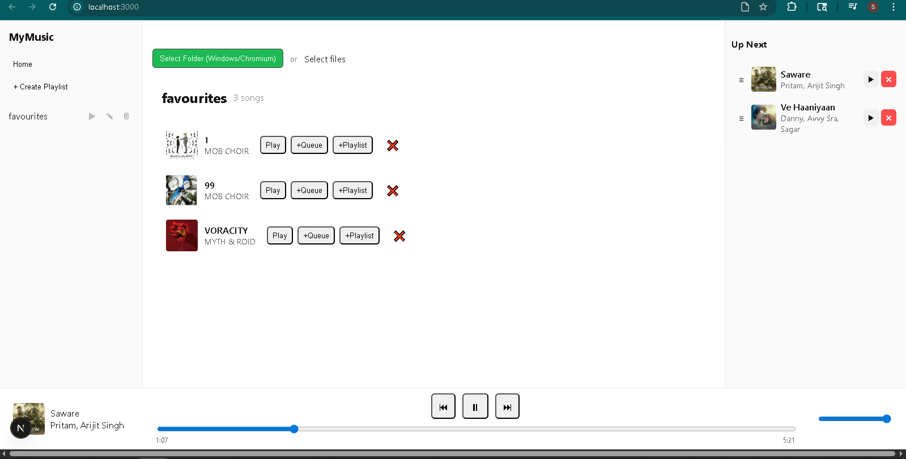

# Next.js Music Player

A browser-based music player built with **Next.js**. Supports importing local audio files, creating and managing playlists, and playing songs directly in the browser.




---

## Features

* **File Importer** – Upload and play your own audio files.
* **Song List** – Displays all uploaded songs with track details.
* **Playlists** – Create, view, and manage playlists.
* **Queue System** – Add songs to a queue for continuous playback.
* **Audio Controls** – Play, pause, skip, and manage playback from a persistent bottom player.
* **Responsive Layout** – Sidebar for navigation, main window for browsing songs/playlists, and right panel for queue.

---

## Project Structure

```
/app
  ├── layout.tsx      # Global layout with PlayerProvider
  ├── page.tsx        # Main page (file importer, song list, playlist view)
/components
  ├── FileImporter.tsx
  ├── Player.tsx
  ├── PlaylistView.tsx
  ├── Queue.tsx
  ├── Sidebar.tsx
  ├── SongList.tsx
  ├── TrackCard.tsx
/contexts
  ├── PlayerContext.tsx  # Global state (tracks, playlists, queue)
/lib
  ├── fsHelpers.ts       # File handling utilities
/styles
  ├── globals.css
  ├── page.css
  ├── Player.css
  ├── Queue.css
  ├── Sidebar.css
  ├── SongList.css
  ├── TrackCard.css
```

---

## Tech Stack

* **Next.js 13+** (App Router)
* **React** with Context API (global state management)
* **TypeScript**
* **CSS Modules** (custom dark-styled UI planned)

---

## Getting Started

### 1. Clone the repo

```bash
git clone https://github.com/ToastedAvenger/next-music-player.git
cd next-music-player
```

### 2. Install dependencies

```bash
npm install
```

### 3. Run locally

```bash
npm run dev
```

Then open [http://localhost:3000](http://localhost:3000) in your browser.

---

## Current Limitations

* Playlist data is **not persistent** (reset after page reload).
* Basic styling only (dark mode planned).
* No user authentication yet.

---

## Future Roadmap

* Persistent playlist storage (local storage / DB).
* Dark mode with theme customization.
* User system with login & profiles.
* Enhanced queue management (drag-and-drop reorder).
* Better UI/UX with animations.
* **Desktop & Mobile App** (via Electron/Capacitor or similar).
* **YouTube Music Integration** – play directly from YouTube Music.
* **Playlist Sync** – sync playlists across sessions and devices (including YouTube Music).
